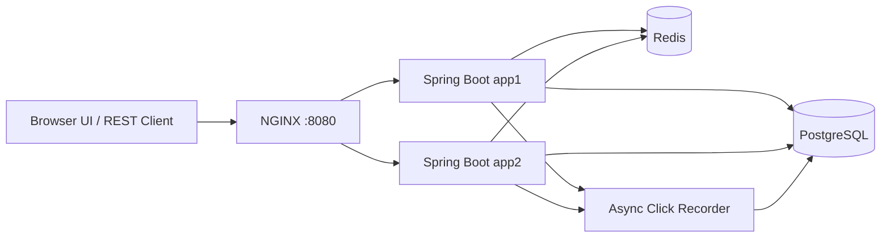

# AI Assisted URL Shortener

A Java, Spring Boot based application that converts a long HTTP or HTTPS URL
into a short, shareable URL and redirects the short URL to the original
destination.

The project demonstrates **engineer-led, AI-assisted software engineering**
across requirement analysis, decomposition, implementation, testing,
validation, scaling, and documentation.

## What the Application Does

```text
Long URL
   ↓
POST /api/v1/urls
   ↓
Validate the request
   ↓
Generate a seven-character Base62 code
or use an optional custom alias
   ↓
Store the code-to-URL mapping
   ↓
Return http://localhost:8080/{shortCode}
   ↓
GET /{shortCode}
   ↓
HTTP 302 redirect to the original URL
```

### Example

```text
Original URL:
https://www.example.com/articles/spring-boot-url-shortener-design

Generated short URL:
http://localhost:8080/aB3xY9Q
```

Opening the generated URL returns:

```http
HTTP/1.1 302 Found
Location: https://www.example.com/articles/spring-boot-url-shortener-design
```

## Base62 Short-Code Generation

When no custom alias is provided, `ShortCodeGenerator` creates a
seven-character code using `SecureRandom` and the following character set:

```text
0-9, a-z, A-Z
```

The service checks for existing codes and retries up to five times when a
collision occurs. A database unique constraint provides the final uniqueness
guarantee.

The internal database identifier remains a `Long`. Base62 is used only for the
public short code.

## Implemented Features

- Shorten valid HTTP and HTTPS URLs
- Generate seven-character Base62 short codes
- Support optional custom aliases
- Normalize aliases to lowercase
- Support optional expiration
- Redirect through HTTP `302 Found`
- Return HTTP `410 Gone` for expired links
- Track click count and last-accessed time
- Record detailed click events asynchronously
- Provide browser-based click analytics
- Validate URLs, aliases, dates, and malformed requests
- Return structured API errors
- Provide a static browser interface
- Use H2 for local and standalone execution
- Use PostgreSQL and Redis in the scalable deployment
- Run two Spring Boot instances behind NGINX
- Fall back to PostgreSQL when Redis is unavailable
- Expose Actuator health and `X-App-Instance`
- Include automated tests and k6 performance-test assets

## Architecture



### Runtime Profiles

| Profile | Database | Redis | Purpose |
|---|---|---|---|
| Default | H2 | Disabled | Local development and standalone Docker execution |
| Scalable | PostgreSQL | Enabled | Shared multi-instance Docker deployment |

PostgreSQL is the source of truth. Redis caches only redirect mappings and
falls back to PostgreSQL on cache misses or Redis failures.

### Redirect Flow

```text
GET /{shortCode}
   ↓
Redis lookup when caching is enabled
   ↓
PostgreSQL fallback on cache miss or Redis failure
   ↓
Validate active and expiration state
   ↓
Atomically update click count and last-accessed time
   ↓
Record detailed click event asynchronously
   ↓
Return HTTP 302 redirect
```

## Technology Stack

| Area | Technology |
|---|---|
| Language | Java 17 |
| Backend | Spring Boot, Spring Web MVC |
| Persistence | Spring Data JPA, Hibernate |
| Local database | H2 |
| Scalable database | PostgreSQL 16 |
| Cache | Redis 7 |
| Load balancing | NGINX |
| Validation | Jakarta Validation |
| Monitoring | Spring Boot Actuator |
| Testing | JUnit 5, Mockito, MockMvc, integration tests |
| Build and deployment | Maven Wrapper, Docker, Docker Compose |
| Performance testing | k6 |

## API Reference

Base URL:

```text
http://localhost:8080
```

### Create a Short URL

```http
POST /api/v1/urls
Content-Type: application/json
```

Only `originalUrl` is required.

```json
{
  "originalUrl": "https://www.example.com/articles/spring-boot-url-shortener-design",
  "expiresAt": "2027-01-01T00:00:00Z",
  "customAlias": "spring-guide"
}
```

Successful creation returns HTTP `201 Created`.

### Redirect

```http
GET /{shortCode}
```

Successful resolution returns HTTP `302 Found` with the original URL in the
`Location` header.

### Aggregate Analytics

```http
GET /api/v1/urls/{shortCode}/analytics
```

Returns link metadata, click count, creation time, last-accessed time, active
state, and expiration.

### Detailed Click Analytics

```http
GET /api/v1/urls/{shortCode}/click-analytics
```

Returns detailed event totals and browser breakdown. Detailed events are
persisted asynchronously, so this endpoint is eventually consistent.

### Health

```http
GET /actuator/health
```

## Validation and HTTP Statuses

| Input | Rule |
|---|---|
| `originalUrl` | Required, maximum 2,048 characters, valid `http://` or `https://` URL |
| `customAlias` | Optional, 4–30 characters, letters, digits, hyphens, and underscores |
| `expiresAt` | Optional, complete ISO-8601 date-time in the future |

Custom aliases are trimmed, converted to lowercase, checked for uniqueness,
and rejected when they conflict with reserved application paths.

| Status | Meaning |
|---|---|
| `201` | Short URL created |
| `302` | Redirect to original URL |
| `400` | Validation failure or malformed request |
| `404` | Short code or resource not found |
| `409` | Custom alias conflict |
| `410` | Short URL expired |
| `503` | Unique code could not be generated after retries |

## AI-Assisted Engineering Workflow

| Phase | AI Support | Engineering Ownership |
|---|---|---|
| Requirements | Organized requirements and surfaced ambiguities | Confirmed scope and acceptance criteria |
| Decomposition | Proposed tasks and dependencies | Prioritized and approved the sequence |
| Design | Suggested API, persistence, caching, and deployment options | Selected architecture and trade-offs |
| Implementation | Assisted with scaffolding and debugging | Reviewed, corrected, and integrated the code |
| Testing | Suggested unit, integration, validation, and performance cases | Added project-specific cases and verified results |
| Documentation | Drafted explanations and structure | Reconciled claims with code and evidence |

```text
Requirement analysis
   ↓
Prompt with intent, constraints, and acceptance criteria
   ↓
Generated design or implementation draft
   ↓
Engineering review and correction
   ↓
Testing and validation
   ↓
Final approval
```

## Engineering Scenarios

### Greenfield

The first version established URL creation, redirects, H2 persistence,
validation, Base62 generation, and aggregate analytics.

### Brownfield

The working service was incrementally extended with expiration, custom aliases,
PostgreSQL, Redis, asynchronous detailed analytics, two application instances,
NGINX, and Docker Compose.

### Ambiguous Requirement

The phrase “memorable short links” was clarified before implementation. The
approved interpretation was an optional, lowercase, validated, unique custom
alias that cannot conflict with reserved routes.

## Testing

Recorded Maven result:

```text
Tests: 71
Failures: 0
Errors: 0
Skipped: 0
```

Coverage includes:

- Base62 generation and collision handling
- URL creation and redirects
- Expiration
- Custom aliases
- Aggregate and detailed analytics
- Redis cache hit, miss, stale, and failure paths
- Browser detection
- Validation and structured errors
- SQL-injection-style and XSS-style input
- End-to-end integration flows
- Application-instance headers

### Performance Testing

The k6 workload is located at:

```text
performance/k6/url-shortener-load.js
```

It includes smoke, redirect, creation, analytics, percentile latency, failure
threshold, and staged virtual-user scenarios.

A successful full 1,000-user benchmark is not claimed.

## Design Trade-Offs

- **Base62 instead of UUIDs:** shorter public URLs, with collision checks and
  bounded retries.
- **Redis with PostgreSQL as source of truth:** faster hot-link resolution with
  database-backed recovery.
- **Synchronous aggregate analytics:** immediate count consistency, with one
  database write per successful redirect.
- **Asynchronous detailed analytics:** protects redirect reliability, with
  brief eventual consistency.
- **H2 locally and PostgreSQL in Docker:** simple local execution plus shared
  persistence for multiple application instances.
- **HTTP 302 redirects:** retains control over analytics and expiration rather
  than encouraging permanent client caching.

## Current Scope and Limitations

- No authentication, authorization, or link ownership
- No rate limiting or abuse prevention
- No update or delete APIs
- No custom domains
- No cleanup scheduler
- No durable analytics queue
- No Flyway or Liquibase migrations
- No replicated or multi-region infrastructure
- No completed 1,000-user benchmark result

## Project Structure

```text
url-shortener/
├── src/main/java/com/assignment/urlshortener/
│   ├── cache/
│   ├── config/
│   ├── controller/
│   ├── dto/
│   ├── entity/
│   ├── exception/
│   ├── repository/
│   ├── service/
│   └── util/
├── src/main/resources/
│   ├── static/
│   ├── application.properties
│   └── application-scalable.properties
├── src/test/java/com/assignment/urlshortener/
├── docs/
├── infra/nginx/
├── performance/k6/
├── Dockerfile
├── docker-compose.yml
├── compose.release.yml
├── pom.xml
├── mvnw
├── mvnw.cmd
└── README.md
```

## Running the Project

The application can be run in three ways:

1. Standalone Docker image for a quick functional review
2. Full Docker stack with PostgreSQL, Redis, app1, app2, and NGINX
3. Local Java development with H2

Complete macOS, Linux, and Windows instructions are available in
[`docs/04-setup-instructions.md`](docs/04-setup-instructions.md).

## Documentation

- [`01-engineering-design-and-architecture.md`](docs/01-engineering-design-and-architecture.md)
- [`02-ai-prompt-and-decision-log.md`](docs/02-ai-prompt-and-decision-log.md)
- [`03-scenarios-validation-and-risks.md`](docs/03-scenarios-validation-and-risks.md)
- [`04-setup-instructions.md`](docs/04-setup-instructions.md)
- [`05-final-engineering-summary.md`](docs/05-final-engineering-summary.md)

## Final Deliverables

- Runnable URL Shortener service and browser interface
- Long URL shortening with seven-character Base62 codes
- Direct HTTP redirects to original URLs
- Aggregate and detailed analytics
- Optional expiration and custom aliases
- Validation and structured error handling
- H2 local and standalone execution
- PostgreSQL, Redis, NGINX, and two application instances
- Architecture and AI-assisted engineering documentation
- Greenfield, brownfield, and ambiguous-requirement scenarios
- Automated tests and k6 performance-test assets


## Author 

Aditi Verma