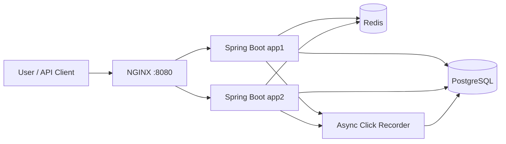

# URL Shortener

A Java 17 and Spring Boot application that converts a long HTTP/HTTPS URL into a short, shareable URL and redirects the short URL directly to the original destination.

The project demonstrates the assignment's main objective: **engineer-led, AI-assisted software engineering** across requirement understanding, decomposition, implementation, testing, validation, and documentation.

## What the Application Does

```text
Long URL
   ↓
POST /api/v1/urls
   ↓
Generate a 7-character code using a Base62 character set
   ↓
Store the code-to-URL mapping
   ↓
Return http://localhost:8080/{shortCode}
   ↓
User opens the short URL
   ↓
GET /{shortCode}
   ↓
HTTP 302 redirect to the original URL
```

When no custom alias is supplied, `ShortCodeGenerator` uses `SecureRandom` to create a seven-character code from:

```text
0-9, a-z, A-Z
```

The application checks that the generated code is unique and retries up to five times if a collision occurs. This Base62-style approach produces a much shorter URL than using a UUID.

### Example

```text
Original URL:
https://www.example.com/articles/spring-boot-url-shortener-design

Generated URL:
http://localhost:8080/aB3xY9Q
```

Opening the generated URL returns:

```http
HTTP/1.1 302 Found
Location: https://www.example.com/articles/spring-boot-url-shortener-design
```

## Implemented Features

- Shorten valid HTTP and HTTPS URLs
- Generate seven-character Base62-style short codes
- Support optional custom aliases
- Redirect short URLs using HTTP `302 Found`
- Support optional expiration dates
- Return HTTP `410 Gone` for expired links
- Track total clicks and last-accessed time
- Record detailed click events asynchronously
- Provide browser-based click analytics
- Validate URLs, aliases, dates, and malformed requests
- Return structured API errors
- Use H2 for local execution
- Use PostgreSQL and Redis in the scalable deployment
- Run two Spring Boot instances behind NGINX
- Fall back to PostgreSQL when Redis is unavailable
- Provide an Actuator health endpoint and browser UI
- Include automated tests and a k6 load-test script

## Architecture



### Redirect Flow

```text
GET /{shortCode}
    ↓
Redis lookup when caching is enabled
    ↓
PostgreSQL fallback on cache miss or Redis failure
    ↓
Validate that the URL is active and not expired
    ↓
Update click count and last-accessed time
    ↓
Record the detailed click event asynchronously
    ↓
Return HTTP 302 redirect
```

PostgreSQL is the source of truth. Redis caches only the short-code-to-original-URL mapping and uses a one-hour default TTL. For expiring links, the cache TTL is limited to the link's remaining lifetime.

## Technology Stack

| Area | Technology |
|---|---|
| Language | Java 17 |
| Backend | Spring Boot, Spring Web MVC |
| Persistence | Spring Data JPA, Hibernate |
| Local database | H2 |
| Scalable database | PostgreSQL 16 |
| Cache | Redis 7 |
| Load balancing | NGINX |
| Validation | Jakarta Validation |
| Monitoring | Spring Boot Actuator |
| Testing | JUnit 5, Mockito, MockMvc, integration tests |
| Build and deployment | Maven Wrapper, Docker, Docker Compose |
| Performance testing | k6 |

# Setup Instructions

## Option 1: Run the Complete Docker Deployment

The Docker deployment starts:

```text
postgres
redis
app1
app2
nginx
```

### 1. Prerequisites

Install Docker Desktop or Docker Engine with Docker Compose.

```bash
docker --version
docker compose version
```

### 2. Open the Project Directory

```bash
cd url-shortener
```

### 3. Start Without Creating an `.env` File

The project contains `docker-compose.yml` and requires only `DB_USERNAME` and `DB_PASSWORD`. They can be supplied directly from the terminal, so creating an `.env` file is optional.

The values below are local demo credentials. Do not use a real production password directly in a command because shell history may retain it.

#### macOS/Linux

```bash
DB_USERNAME=urlshortener \
DB_PASSWORD=urlshortener_demo \
docker compose \
  -p url-shortener \
  -f docker-compose.yml \
  up -d --build
```

One line:

```bash
DB_USERNAME=urlshortener DB_PASSWORD=urlshortener_demo docker compose -p url-shortener -f docker-compose.yml up -d --build
```

#### Windows PowerShell

```powershell
$env:DB_USERNAME="urlshortener"
$env:DB_PASSWORD="urlshortener_demo"

docker compose `
  -p url-shortener `
  -f .\docker-compose.yml `
  up -d --build
```

One line:

```powershell
$env:DB_USERNAME="urlshortener"; $env:DB_PASSWORD="urlshortener_demo"; docker compose -p url-shortener -f .\docker-compose.yml up -d --build
```

PowerShell keeps these variables in the current terminal session.

### 4. Check Status

#### macOS/Linux

```bash
DB_USERNAME=urlshortener DB_PASSWORD=urlshortener_demo \
docker compose -p url-shortener -f docker-compose.yml ps
```

#### Windows PowerShell

```powershell
docker compose -p url-shortener -f .\docker-compose.yml ps
```

Expected services:

```text
postgres
redis
app1
app2
nginx
```

### 5. Open the Application

```text
http://localhost:8080
```

Health check:

```bash
curl -i http://localhost:8080/actuator/health
```

### 6. Stop the Deployment

#### macOS/Linux

```bash
DB_USERNAME=urlshortener DB_PASSWORD=urlshortener_demo \
docker compose -p url-shortener -f docker-compose.yml down
```

Remove containers and stored volumes:

```bash
DB_USERNAME=urlshortener DB_PASSWORD=urlshortener_demo \
docker compose -p url-shortener -f docker-compose.yml down -v
```

#### Windows PowerShell

```powershell
docker compose -p url-shortener -f .\docker-compose.yml down
```

Remove stored volumes as well:

```powershell
docker compose -p url-shortener -f .\docker-compose.yml down -v
```

## Option 2: Run Locally with H2

Install Java 17 or later:

```bash
java -version
```

### macOS/Linux

```bash
./mvnw spring-boot:run
```

### Windows PowerShell

```powershell
.\mvnw.cmd spring-boot:run
```

Open:

```text
http://localhost:8080
```

The default profile uses the embedded H2 database and disables Redis caching, so PostgreSQL and Redis are not required.

# API Reference

Base URL:

```text
http://localhost:8080
```

## 1. Create a Short URL

```http
POST /api/v1/urls
Content-Type: application/json
```

Only `originalUrl` is required.

```bash
curl -i -X POST http://localhost:8080/api/v1/urls \
  -H "Content-Type: application/json" \
  -d '{"originalUrl":"https://www.example.com/articles/spring-boot-url-shortener-design"}'
```

Example response:

```json
{
  "shortCode": "aB3xY9Q",
  "shortUrl": "http://localhost:8080/aB3xY9Q",
  "originalUrl": "https://www.example.com/articles/spring-boot-url-shortener-design",
  "createdAt": "2026-08-06T09:00:00Z",
  "expiresAt": null
}
```

Successful creation returns HTTP `201 Created`.

### Optional Expiration and Custom Alias

```bash
curl -i -X POST http://localhost:8080/api/v1/urls \
  -H "Content-Type: application/json" \
  -d '{
    "originalUrl":"https://www.example.com/articles/spring-boot-url-shortener-design",
    "expiresAt":"2027-01-01T00:00:00Z",
    "customAlias":"spring-guide"
  }'
```

## 2. Redirect

```http
GET /{shortCode}
```

```bash
curl -i http://localhost:8080/aB3xY9Q
```

Expected response:

```http
HTTP/1.1 302 Found
Location: https://www.example.com/articles/spring-boot-url-shortener-design
```

Follow the redirect:

```bash
curl -L http://localhost:8080/aB3xY9Q
```

## 3. Aggregate Analytics

```http
GET /api/v1/urls/{shortCode}/analytics
```

```bash
curl -i http://localhost:8080/api/v1/urls/aB3xY9Q/analytics
```

The response includes the original URL, click count, creation time, last-accessed time, active status, and expiration time.

## 4. Detailed Click Analytics

```http
GET /api/v1/urls/{shortCode}/click-analytics
```

```bash
curl -i http://localhost:8080/api/v1/urls/aB3xY9Q/click-analytics
```

Example response:

```json
{
  "shortCode": "aB3xY9Q",
  "totalEvents": 3,
  "byBrowser": {
    "Chrome": 2,
    "Firefox": 1
  }
}
```

## 5. Health Check

```bash
curl -i http://localhost:8080/actuator/health
```

# Validation and Errors

| Input | Rule |
|---|---|
| `originalUrl` | Required, maximum 2,048 characters, valid `http://` or `https://` URL |
| `customAlias` | Optional, 4-30 characters, lowercase letters, digits, hyphens, and underscores |
| `expiresAt` | Optional, complete ISO-8601 date-time in the future |

Custom aliases are trimmed, converted to lowercase, checked for uniqueness, and rejected when they conflict with reserved paths such as `api`, `actuator`, `health`, `admin`, `login`, `logout`, `docs`, or `swagger`.

| Status | Meaning |
|---|---|
| `201` | Short URL created |
| `302` | Redirect to original URL |
| `400` | Validation failure or malformed request |
| `404` | Short code or resource not found |
| `409` | Custom alias conflict |
| `410` | Short URL expired |
| `503` | Unique code could not be generated after retries |

# AI-Assisted Engineering Workflow

| Phase | How AI Was Used | Engineer's Role |
|---|---|---|
| Requirements | Summarized requirements and identified ambiguity | Confirmed scope and acceptance criteria |
| Decomposition | Proposed tasks, dependencies, and sequence | Prioritized and approved the plan |
| Design | Suggested API, persistence, caching, and deployment options | Selected the architecture and trade-offs |
| Implementation | Assisted with scaffolding, debugging, and implementation ideas | Reviewed, corrected, integrated, and owned the code |
| Testing | Suggested unit, integration, validation, and performance cases | Added project-specific cases and verified behavior |
| Documentation | Drafted explanations and setup steps | Checked each claim against the repository |

```text
Requirement Analysis
        ↓
Prompt with Intent, Constraints, and Acceptance Criteria
        ↓
Generated Design or Implementation Draft
        ↓
Engineer Review and Correction
        ↓
Testing and Validation
        ↓
Engineer Approval
```

# Engineering Scenarios

## Scenario 1 - Greenfield

### Requirement

Build a URL Shortener from scratch that creates short links, redirects users, and provides analytics.

### Decomposition

| Task | AI Assistance | Engineer Review |
|---|---|---|
| Design database | Suggested the URL mapping and analytics fields | Confirmed the schema and unique short-code constraint |
| Define REST APIs | Generated API contract options | Selected versioned create/analytics APIs and `/{shortCode}` redirects |
| Implement shortening | Compared UUID and Base62-style approaches | Selected a seven-character Base62-style random code |
| Add persistence | Suggested repository and service boundaries | Reviewed transactions and atomic click updates |
| Add caching | Suggested cache-aside Redis integration | Added a cache abstraction, TTL rules, and database fallback |
| Add analytics | Suggested aggregate and event-level tracking | Kept aggregate updates synchronous and event recording asynchronous |

### Validation

- Unit tests
- Controller and validation tests
- Integration tests
- Manual API tests
- k6 performance-test workload

### Deliverable

Working end-to-end URL Shortener service.

## Scenario 2 - Brownfield

### Existing System

The initial implementation supported URL creation, redirects, persistence, and aggregate click counts using one application instance.

### Enhancement Request

Add expiration, custom aliases, Redis caching, PostgreSQL shared persistence, detailed analytics, two application instances, and NGINX load balancing.

### AI-Assisted Decomposition

```text
Review Current Code
        ↓
Dependency and Impact Analysis
        ↓
Identify Regression Risks
        ↓
Suggest Incremental Changes
        ↓
Implement Enhancements
        ↓
Generate and Extend Tests
        ↓
Engineer Review
```

### Engineer Decisions

- Kept expiration optional for backward compatibility
- Returned HTTP `410 Gone` for expired links
- Limited Redis TTL to the remaining link lifetime
- Kept PostgreSQL as the source of truth
- Allowed local mode to run without Redis through `NoOpRedirectCache`
- Added asynchronous detailed click-event recording
- Added NGINX and two application instances with shared persistence

### Validation

- Regression tests for requests without expiration
- Expired-link and click-count tests
- Cache hit, miss, stale-entry, and Redis-failure tests
- Cross-instance Docker validation
- Analytics and browser-detection tests

### Deliverables

Updated architecture, backward-compatible enhancements, expanded tests, and a Docker Compose deployment.

## Scenario 3 - Ambiguous Requirement

### Requirement

> Users want memorable short links.

### Clarification Questions

- Does the user choose the alias, or should the system generate words?
- Are aliases case-sensitive?
- Which characters and lengths are allowed?
- Which application routes are reserved?
- What happens when an alias already exists?
- Can an expired alias be reused?

### Clarified Requirement

Support an optional user-selected custom alias that is normalized to lowercase, contains 4-30 valid characters, is unique, and does not conflict with reserved application routes.

```text
Ambiguous Requirement
        ↓
Generate Clarification Questions
        ↓
Confirm Alias Rules
        ↓
Update Request Model and Service Logic
        ↓
Add Validation and Conflict Handling
        ↓
Generate Tests
        ↓
Engineer Review and Acceptance
```

This demonstrates resolving uncertainty before implementation rather than coding against an undefined requirement.

# Testing Strategy

## Automated Tests

### macOS/Linux

```bash
./mvnw clean test
```

### Windows PowerShell

```powershell
.\mvnw.cmd clean test
```

The included Maven Surefire reports record:

```text
Tests: 71
Failures: 0
Errors: 0
Skipped: 0
```

Tests cover short-code generation, collision handling, creation, redirects, aliases, expiration, analytics, caching behavior, Redis fallback, browser detection, validation, structured errors, integration flows, and instance headers.

## Performance Testing

The k6 workload is located at:

```text
performance/k6/url-shortener-load.js
```

Smoke test:

```bash
REDIRECT_VUS=2 DURATION=10s k6 run performance/k6/url-shortener-load.js
```

Staged test up to 1,000 virtual users:

```bash
STAGED=true k6 run performance/k6/url-shortener-load.js
```

# Design Trade-offs

- **Base62-style random codes instead of UUIDs:** shorter URLs, with collision checks and bounded retries.
- **Redis with PostgreSQL as the source of truth:** faster redirect lookup while retaining database-backed recovery.
- **Asynchronous detailed analytics:** less work on the redirect path, with brief eventual consistency between aggregate and event totals.
- **H2 locally and PostgreSQL in Docker:** simple local startup plus shared transactional storage for multiple instances.
- **HTTP 302 redirects:** avoids treating every mapping as permanently fixed in client caches.

# Current Prototype Scope

- The API does not currently apply user authentication or link ownership.
- Browser aggregation is exposed; country is stored from `CF-IPCountry` when available but is not currently aggregated by the API.
- A k6 workload is provided, but production latency and throughput depend on the execution environment.

# Project Structure

```text
url-shortener/
├── src/main/java/com/assignment/urlshortener/
│   ├── cache/
│   ├── config/
│   ├── controller/
│   ├── dto/
│   ├── entity/
│   ├── exception/
│   ├── repository/
│   ├── service/
│   └── util/
├── src/main/resources/
│   ├── static/
│   ├── application.properties
│   └── application-scalable.properties
├── src/test/java/com/assignment/urlshortener/
├── infra/nginx/
├── performance/k6/
├── Dockerfile
├── docker-compose.yml
├── pom.xml
├── mvnw
├── mvnw.cmd
└── README.md
```


## Running the Project

The application can be run in three ways:

1. Standalone Docker image for a quick functional review
2. Full Docker stack with PostgreSQL, Redis, app1, app2, and NGINX
3. Local Java development with H2

See [`docs/04-setup-instructions.md`](docs/04-setup-instructions.md) for complete macOS, Linux, and Windows commands.

# Final Deliverables

- Runnable URL Shortener service and browser interface
- Long URL shortening with seven-character Base62-style codes
- Direct redirects to original URLs
- Aggregate and detailed analytics
- Optional expiration and custom aliases
- Input validation and structured errors
- H2 local execution
- PostgreSQL, Redis, NGINX, and two application instances through Docker Compose
- Architecture and AI-assisted engineering documentation
- Greenfield, brownfield, and ambiguous-requirement scenarios
- Automated tests and a k6 workload
