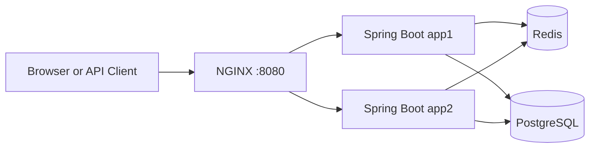
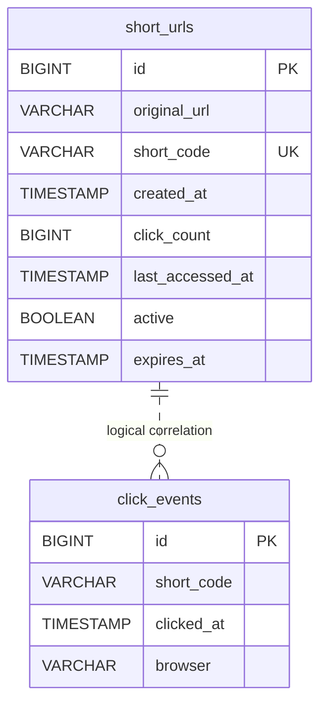

# Engineering Design and Architecture

## 1. Overview
This project implements a Java Spring Boot URL shortener that evolved from a
greenfield service into a Docker-based system with shared persistence, Redis
caching, two application instances, NGINX routing, analytics, and automated
testing.

The implementation progressed through:
1. Core URL creation and redirect.
2. Validation, expiration, analytics, and custom aliases.
3. PostgreSQL and Redis integration.
4. Horizontal execution through app1, app2, and NGINX.
5. Asynchronous detailed click-event capture.
6. Security tests and k6 performance-test scripts.

## 2. Scope

### Implemented
- Valid HTTP/HTTPS URL creation.
- Seven-character Base62 short codes.
- Optional custom aliases.
- Optional expiration.
- `302 Found` redirects.
- Aggregate click analytics.
- Detailed click-event capture.
- Browser detection from `User-Agent`.
- Consistent API error responses.
- Static browser UI.
- H2 for local development.
- PostgreSQL for shared persistence.
- Optional Redis cache-aside behavior.
- Two Spring Boot instances behind NGINX.
- Docker Compose startup.
- Unit, controller, integration, security, and k6 test assets.

### Out of scope
- Authentication and authorization.
- User ownership.
- Multi-region deployment.
- Production secret management.
- Durable message-queue delivery.

## 3. Architecture



The application instances are stateless and share PostgreSQL and Redis.
NGINX provides one public endpoint and distributes requests between them.
The default local profile uses H2.

### Main components

| Component | Responsibility |
|---|---|
| `UrlController` | URL creation and analytics APIs |
| `RedirectController` | Short-code resolution and redirects |
| `UrlShortenerService` | Creation, aliases, expiration, caching, resolution, analytics |
| `ShortUrlRepository` | Persistence and atomic click updates |
| `ShortCodeGenerator` | Seven-character Base62 generation |
| `RedisRedirectCache` | Redis cache-aside implementation |
| `ClickEventRecorder` | Asynchronous event persistence |
| `BrowserDetector` | Browser-family detection |
| `GlobalExceptionHandler` | Consistent sanitized errors |
| `InstanceHeaderFilter` | Adds `X-App-Instance` |

## 4. Data Model

### `ShortUrl`

| Field | Purpose |
|---|---|
| `id` | Internal relational primary key |
| `originalUrl` | Destination URL |
| `shortCode` | Generated code or custom alias |
| `createdAt` | Creation time |
| `clickCount` | Successful redirect count |
| `lastAccessedAt` | Latest access time |
| `active` | Logical active state |
| `expiresAt` | Optional expiration |

`shortCode` has a unique database constraint for uniqueness and fast lookup.

### `ClickEvent`

| Field | Purpose |
|---|---|
| `id` | Internal relational primary key |
| `shortCode` | Successfully resolved code |
| `clickedAt` | Redirect time |
| `browser` | Browser derived from `User-Agent` |

The current implementation does not store country information.
`ClickEvent.shortCode` is a logical reference; no database foreign key is used.



The unique index on `short_code` supports redirects, analytics lookup,
collision checks, and custom-alias checks. Future reporting may justify indexes
on `clicked_at`, `expires_at`, or `(short_code, clicked_at)`.

## 5. API Design

### Create
```http
POST /api/v1/urls
Content-Type: application/json
```

```json
{
  "originalUrl": "https://example.com/articles/system-design",
  "expiresAt": "2026-08-10T18:00:00Z",
  "customAlias": "system-design"
}
```

Success: `201 Created`.

### Redirect
```http
GET /{shortCode}
```

```http
HTTP/1.1 302 Found
Location: https://example.com/articles/system-design
X-App-Instance: app1
```

The route accepts letters, digits, hyphens, and underscores so static resources
are not interpreted as short codes.

### Analytics
```http
GET /api/v1/urls/{shortCode}/analytics
```

The response includes original URL, click count, creation time, last access,
active state, and expiration.

### Errors

| Situation | Status |
|---|---|
| Invalid request | `400 Bad Request` |
| Unknown or inactive code | `404 Not Found` |
| Duplicate or reserved alias | `409 Conflict` |
| Expired code | `410 Gone` |
| Code generation exhausted | `503 Service Unavailable` |
| Unexpected error | `500 Internal Server Error` |

Unexpected errors are logged internally while clients receive sanitized
responses without stack traces or database details.

## 6. Core Engineering Decisions

### Base62 short codes
Alphabet:
```text
0123456789abcdefghijklmnopqrstuvwxyzABCDEFGHIJKLMNOPQRSTUVWXYZ
```

Each generated code has seven characters:
```text
62^7 = 3,521,614,606,208 possible values
```

The generator uses `SecureRandom`, up to five attempts, application-level
collision checks, and a database unique constraint. The database `Long id`
remains the internal primary key.

### Expiration
- `expiresAt` is optional.
- Existing clients can omit it.
- `Instant` provides UTC-safe handling.
- Past values are rejected.
- Expired links return `410 Gone`.
- Expired links do not increment analytics.
- Expired codes are not reused.
- Redis TTL does not exceed the remaining link lifetime.

### Custom aliases
The ambiguous “memorable URL” requirement was interpreted as an optional
user-selected alias.

Rules:
- Lowercase normalization.
- Length from 4 to 30 characters.
- Letters, digits, hyphens, and underscores only.
- Duplicate aliases return `409 Conflict`.
- Reserved routes return `409 Conflict`.
- Expired or inactive aliases are not reused.

Reserved examples:
```text
api, actuator, health, admin, login, logout, docs, swagger
```

### Atomic aggregate analytics
A read-modify-save sequence could lose updates under concurrency. The repository
therefore performs one conditional update:

```text
clickCount = clickCount + 1
lastAccessedAt = accessedAt
```

The update applies only when the mapping is active and not expired.

### Asynchronous detailed events
`ClickEventRecorder` uses `@Async` in a separate Spring bean.

The controller passes:
- `shortCode`
- Current timestamp
- `User-Agent`

`HttpServletRequest` is not passed to the background thread. Event-save failures
are caught and logged without failing the redirect.

This accepts eventual consistency and possible event loss if the process stops
before completion. Kafka was not added because durable replay is outside scope.

### Redis cache-aside
Redis stores mappings under:
```text
redirect:{shortCode}
```

Behavior:
- Cache hit: use Redis.
- Cache miss: load from PostgreSQL and populate Redis.
- Redis failure: continue through PostgreSQL.
- PostgreSQL remains the source of truth.
- Cache TTL respects expiration.

### Horizontal execution
The scalable profile uses PostgreSQL and Redis so app1 and app2 share state.
`X-App-Instance` identifies the serving application instance.

The Docker topology demonstrates shared persistence and request distribution,
but not full production high availability because NGINX, PostgreSQL, and Redis
remain single services.

## 7. Main Request Flow

### URL creation
1. Validate the request.
2. Normalize an optional custom alias.
3. Generate a Base62 code when no alias is supplied.
4. Check for collisions.
5. Persist `ShortUrl`.
6. Return `201 Created`.

### Redirect
1. Receive the short code.
2. Check Redis when enabled.
3. On a miss, load from PostgreSQL.
4. Validate active and expiration state.
5. Atomically update aggregate analytics.
6. Trigger detailed event persistence asynchronously.
7. Return `302 Found`.

Aggregate analytics are immediately consistent. Detailed event persistence is
eventually consistent.

## 8. Testing Strategy

### Implemented tests
- Base62 generation.
- Service behavior.
- Request validation.
- REST controllers.
- URL creation and redirect.
- Expiration.
- Custom aliases.
- Browser detection.
- Asynchronous event recording.
- Sanitized error responses.
- SQL-injection-style inputs.
- XSS-style inputs.
- Unsafe URL schemes.

### Performance tests
k6 scripts support:
- Smoke tests.
- Redirect-heavy workloads.
- Lower-rate URL creation.
- Analytics requests.
- Configurable virtual users.
- p50, p95, and p99 latency.
- Error-rate thresholds.
- Staged execution up to 1,000 virtual users.

The project must not claim support for 1,000 concurrent users until the full
test completes successfully and all thresholds pass.

### Remaining gaps
- PostgreSQL Testcontainers integration.
- Redis Testcontainers integration.
- Redis hit/miss metrics.
- Database and Redis failure testing.
- Longer-duration soak testing.

## 9. Trade-Offs

| Decision | Benefit | Limitation |
|---|---|---|
| Random Base62 codes | Compact, non-sequential URLs | Requires collision handling |
| PostgreSQL | Transactions and uniqueness | External infrastructure in scalable mode |
| Redis cache-aside | Reduces repeated lookups | Adds cache complexity |
| Synchronous aggregate analytics | Immediate click counts | Database write per redirect |
| Asynchronous click events | Keeps event persistence off request thread | Eventual consistency and possible loss |
| Static UI | Simple and lightweight | Limited frontend features |
| H2 local profile | Fast setup | Does not fully reproduce PostgreSQL |
| Two apps behind NGINX | Demonstrates horizontal execution | Not complete high availability |

## 10. Known Limitations
- Generated-code save-time races are not fully retried.
- Detailed events are not durably queued.
- Redis hit ratio is not yet measured.
- H2 tests do not prove all PostgreSQL-specific behavior.
- No authentication, ownership, rate limiting, or abuse prevention.
- No multi-region deployment.
- No production TLS or secret-management system.
- No verified 1,000-user performance claim.

## 11. Architecture Evolution

| Stage | Decision |
|---|---|
| Greenfield core | Spring Boot, JPA, H2 |
| Uniqueness | Base62, retries, unique constraint |
| Analytics | Atomic repository update |
| Expiration | Optional `Instant expiresAt` |
| Custom aliases | Validation and reservation rules |
| Browser UI | Static HTML, CSS, JavaScript |
| Shared persistence | PostgreSQL |
| Redirect caching | Redis cache-aside |
| Horizontal execution | app1 and app2 |
| Single entry point | NGINX |
| Reproducibility | Docker Compose |
| Detailed analytics | Asynchronous `ClickEvent` persistence |
| Security validation | Focused automated tests |
| Performance preparation | Configurable k6 scripts |

## 12. Final Engineering Position
This project is a bounded prototype rather than a claim of production
completeness.

It demonstrates:
- Greenfield-to-scalable architecture evolution.
- Backward-compatible feature additions.
- Explicit handling of ambiguous requirements.
- Database-enforced uniqueness.
- Atomic aggregate analytics.
- Optional Redis caching.
- Shared persistence across multiple application instances.
- Failure isolation for detailed analytics.
- Security-focused validation.
- Reproducible Docker execution.
- Performance-test assets.

Additional infrastructure should be introduced only when testing identifies a
real performance or reliability requirement.
