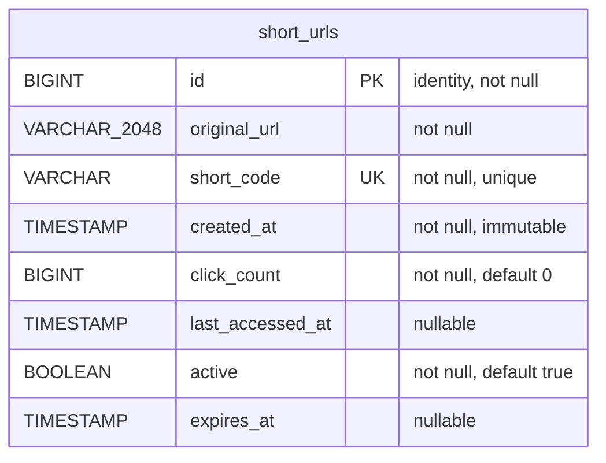
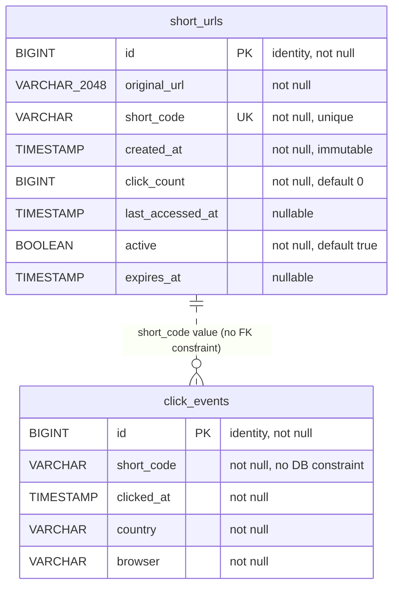
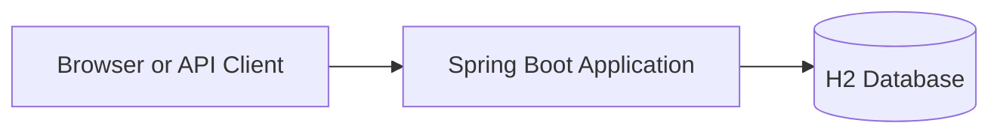
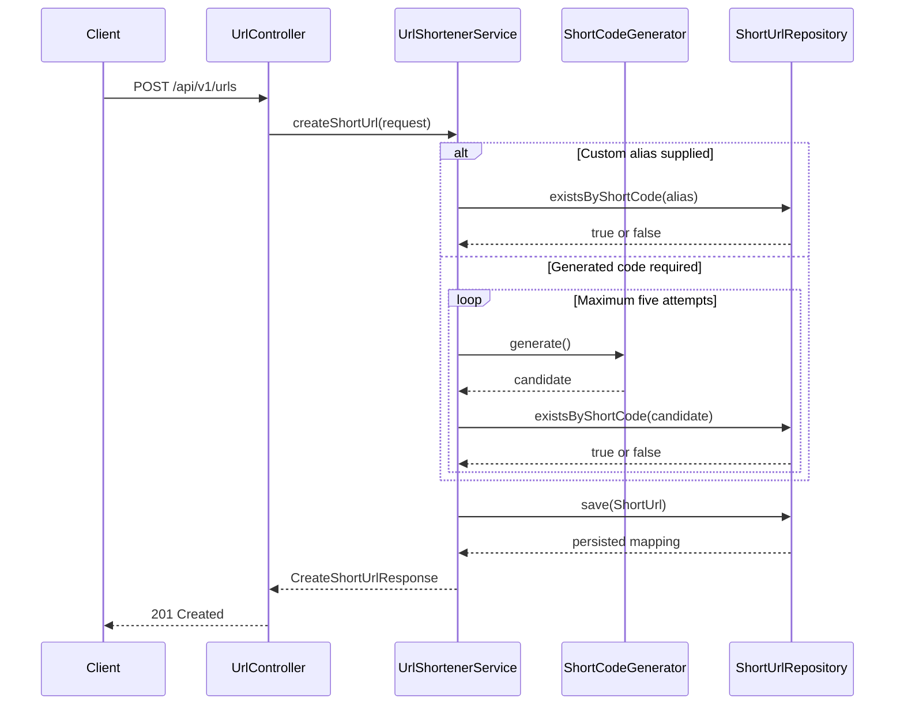
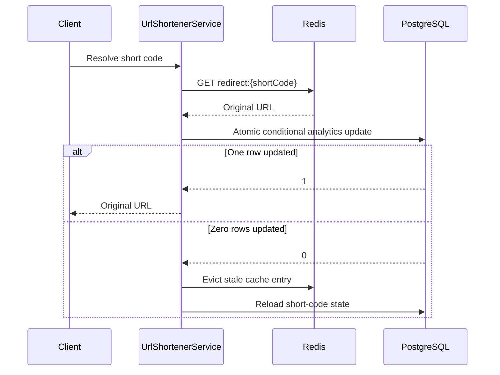
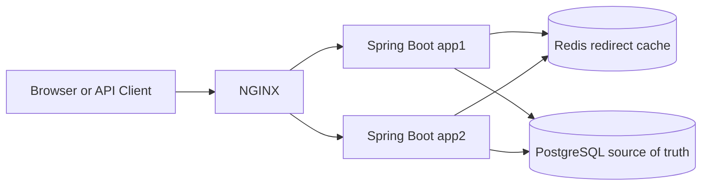
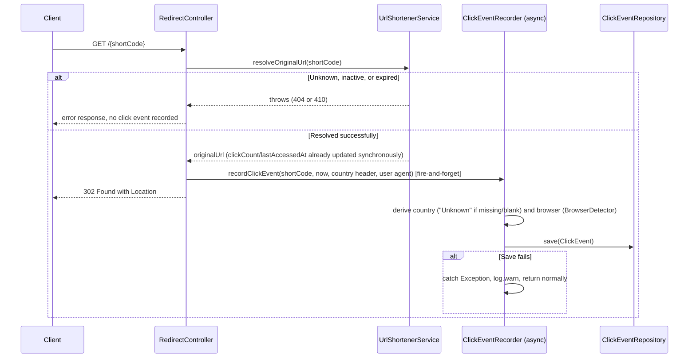

# Engineering Design and Architecture

## 1. Engineering approach

I treated the URL shortener as an evolving backend system rather than a
single code-generation task. I first defined the core behavior and created a
small greenfield architecture. After the core flow worked, I reviewed the
non-functional gaps and introduced focused deep dives for uniqueness,
expiration, custom aliases, redirect performance, shared persistence, and
horizontal scaling.

This sequence allowed every later technology to solve an identified problem.
H2 supported fast local development. PostgreSQL provided shared durable state.
Redis reduced repeated redirect lookups. Two stateless Spring Boot instances
demonstrated horizontal execution. NGINX provided one entry point and routed
requests to both instances.

## 2. Problem statement

The system must accept an original URL and return a compact short URL. When a
client accesses the short URL, the system must resolve the stored mapping,
apply active and expiration rules, update analytics, and return an HTTP
redirect.

The assignment also requires visible evidence of engineer-led AI use.
Therefore, the solution must include not only working code but also
traceability of requirement interpretation, task decomposition, AI prompts,
engineer review, corrections, tests, risks, and final decisions.

## 3. Functional requirements

### 3.1 Core requirements

1. The system must accept a valid HTTP or HTTPS URL.
2. The system must create a unique short code.
3. The system must return a complete short URL.
4. The system must resolve a valid short code.
5. The system must return `302 Found` with the original URL in the
   `Location` header.
6. The system must track the number of successful redirects.
7. The system must record the last successful access time.
8. The system must expose analytics for an existing short code.
9. The system must return consistent error responses.

### 3.2 Enhancements

1. The system may accept an optional future `expiresAt`.
2. The system may accept an optional `customAlias`.
3. The system must provide a simple browser interface.
4. The scalable profile must use shared PostgreSQL persistence.
5. The scalable profile must use an optional Redis redirect cache.
6. The scalable demonstration must run two application instances behind
   NGINX.
7. Each response must expose the serving application through
   `X-App-Instance`.

### 3.2a Detailed click-event capture

1. Each successful redirect must record a detailed click event containing
   `shortCode`, `clickedAt`, `country`, and `browser`.
2. Detailed event persistence must not delay or break the redirect response.
3. Detailed event persistence must not change the existing synchronous
   `clickCount` and `lastAccessedAt` behavior on `ShortUrl`.
4. Unknown, inactive, expired, and otherwise failed redirects must not
   create a click event.

### 3.3 Out-of-scope items

The prototype does not implement authentication, authorization, per-user
ownership, rate limiting, malicious-link scanning, reporting APIs over the
captured click data, a durable message queue for event delivery,
multi-region replication, CDN redirects, Kubernetes, or production secret
management.

## 4. Non-functional requirements and design goals

The following requirements guided the design:

- Short-code uniqueness must be protected at the database level.
- Redirect traffic is expected to be significantly higher than creation
  traffic.
- The redirect path should avoid unnecessary database reads.
- The application should remain stateless so that multiple instances can
  process any request.
- A Redis failure should degrade performance rather than break valid links.
- Expiration and active-state checks must remain correct when a cache is used.
- Brownfield changes must preserve existing clients.
- The local developer experience must remain simple.
- The project must remain modular, testable, and easy to review.

These are design goals. The prototype does not claim that production latency,
throughput, or availability targets were benchmarked.

## 5. Core entity

The final code uses one primary JPA entity named `ShortUrl`.

| Field | Type | Purpose |
|---|---|---|
| `id` | `Long` | It provides the generated relational identifier. |
| `originalUrl` | `String` | It stores the destination URL and allows up to 2048 characters. |
| `shortCode` | `String` | It stores the generated code or normalized custom alias and has a unique database constraint. |
| `createdAt` | `Instant` | It records the creation time. |
| `clickCount` | `long` | It records successful redirects. |
| `lastAccessedAt` | `Instant` | It records the latest successful redirect. |
| `active` | `boolean` | It supports logical deactivation. |
| `expiresAt` | `Instant` | It stores optional expiration. |

The application uses a generated `id` as the primary key and a unique
constraint on `shortCode`. This decision keeps JPA identity conventional
while retaining an indexed unique lookup.

### 5.1 Entity-relationship diagram

The entity maps to a single table, `short_urls`, with one row per short
code. Column names follow Spring Boot's default Hibernate physical naming
strategy, which converts each camelCase field to snake_case.



There is only one table and no foreign keys, so the diagram has a single
entity block and no relationships. The exact SQL type names generated by
Hibernate differ slightly between H2 and PostgreSQL (for example `varchar`
length representation), but the column set, nullability, primary key, and
unique constraint are identical because both are generated from the same
`ShortUrl` entity.

| Column | Source field | Nullable | Key |
|---|---|---|---|
| `id` | `id` | No (generated) | Primary key |
| `original_url` | `originalUrl` | No | — |
| `short_code` | `shortCode` | No | Unique |
| `created_at` | `createdAt` | No (also not updatable) | — |
| `click_count` | `clickCount` | No (primitive `long`, defaults to 0) | — |
| `last_accessed_at` | `lastAccessedAt` | Yes | — |
| `active` | `active` | No (primitive `boolean`, defaults to true) | — |
| `expires_at` | `expiresAt` | Yes | — |

### 5.2 Database design

**Initial greenfield schema.** The first schema contained only the fields
needed to create and resolve a mapping: `id`, `originalUrl`, `shortCode`,
and `createdAt`. This was intentionally minimal so the core create-and-redirect
flow could be implemented and reviewed before any analytics or lifecycle
behavior existed.

**Fields added for analytics and expiration.** `clickCount` and
`lastAccessedAt` were added when redirect analytics became a requirement;
`clickCount` starts at zero and is only ever incremented by
`ShortUrlRepository.incrementClickCount`, and `lastAccessedAt` is updated in
the same statement. `active` and `expiresAt` were added for the expiration
brownfield change described in section 11: `active` supports logical
deactivation without deleting history, and `expiresAt` is a nullable
`Instant` so existing non-expiring rows and API clients remain valid.

**Why custom aliases reuse `shortCode` instead of a separate column.** A
custom alias and a generated code serve the same purpose: they are the
lookup key a redirect request arrives with. `UrlShortenerService.reserveCustomAlias`
validates a supplied alias (length, allowed characters, reserved words,
uniqueness) and then stores it directly as `shortCode`, exactly like a
generated candidate. Adding a second column (for example `alias` alongside
`shortCode`) would force every lookup, the unique constraint, and the
redirect path to branch on which column is populated, for no behavioral
benefit — a short code is a short code regardless of how it was chosen.
Reusing the single column keeps `findByShortCode`, `existsByShortCode`, and
`incrementClickCount` uniform for both cases.

**Same schema across H2 and PostgreSQL.** Both profiles map the identical
`ShortUrl` entity with no profile-specific annotations, so the logical
schema (columns, nullability, primary key, unique constraint) is the same
in both. The default profile lets Hibernate manage the H2 schema
automatically for local development; the `scalable` profile points at a
PostgreSQL instance with `spring.jpa.hibernate.ddl-auto=update`, applying
the same entity mapping to shared, durable storage. No PostgreSQL-specific
or H2-specific column definitions exist in the entity.

### 5.3 Index review

**Why `short_code` requires a unique index.** `shortCode` is the key every
redirect, analytics, and creation-collision check looks up by, and two rows
must never resolve to the same short code. `@Column(nullable = false, unique = true)`
on `ShortUrl.shortCode` creates a unique index, which both enforces that
invariant at the database level (closing the race-condition window between
an application-level existence check and a save) and makes point lookups by
`shortCode` efficient.

**Repository methods that use `shortCode`.** All three query methods on
`ShortUrlRepository` filter by `shortCode`:

- `findByShortCode(String)` — used to resolve a redirect and to build
  analytics responses.
- `existsByShortCode(String)` — used during generated-code collision
  checks and custom-alias reservation.
- `incrementClickCount(String, Instant)` — used for the atomic analytics
  update on every successful redirect.

Every one of these benefits directly from the unique index on `short_code`.

**Why no additional indexes are currently needed.** No query filters or
sorts by `originalUrl`, `createdAt`, `clickCount`, `lastAccessedAt`,
`active`, or `expiresAt` on their own; the only predicates against those
columns (`active = true`, `expiresAt` comparisons in
`incrementClickCount`) ride along with the `shortCode` equality filter, so
the unique index already makes those lookups selective. Adding indexes
without a query that needs them would only add write overhead to every
create and every redirect.

**Future queries that might justify an index.** An index on `expires_at`
would help if a scheduled job is added to sweep or deactivate expired rows
in bulk, since that would scan by `expires_at` without a `short_code`
predicate. A reporting index — for example a composite index on
`(active, created_at)` or `(click_count)` — would help if the system adds
aggregate or ranking queries such as "most-clicked active links" or
"links created in a date range," which do not exist today.

### 5.4 The `ClickEvent` entity and its relationship to `ShortUrl`

A reporting enhancement required capturing one row per successful redirect
instead of only the running `clickCount` total on `ShortUrl`. This detail is
stored in a second entity, `ClickEvent`, mapped to its own table so that
detailed click history is separate from the `ShortUrl` aggregate.

| Field | Type | Purpose |
|---|---|---|
| `id` | `Long` | It provides the generated relational identifier. |
| `shortCode` | `String` | It records which short code was clicked. |
| `clickedAt` | `Instant` | It records when the redirect happened. |
| `country` | `String` | It stores the value read from the `CF-IPCountry` request header, or `"Unknown"` when the header is absent or blank. |
| `browser` | `String` | It stores the browser family derived from `User-Agent` by `BrowserDetector`, or `"Unknown"` when it cannot be determined. |

`ClickEvent.shortCode` is a plain `String` column. It is **not** a JPA
association (`@ManyToOne`/`@JoinColumn`) and there is no database foreign
key from `click_events.short_code` to `short_urls.short_code`. The two
tables are correlated only by an application-level convention: both store
the same short-code value. This is a deliberate simplification for the
current scope — a foreign key is not implemented, so this document does not
claim one exists.



The relationship line is drawn as a logical, non-enforced correlation
(`short_urls.short_code` value equals `click_events.short_code` value) to
reflect that Hibernate does not generate a foreign key for this mapping.
`ClickEventRepository` is a plain `JpaRepository<ClickEvent, Long>` with no
custom query methods; every write goes through `ClickEventRepository.save`.

## 6. API design

### 6.1 Create a short URL

```http
POST /api/v1/urls
Content-Type: application/json
```

Example request:

```json
{
  "originalUrl": "https://example.com/articles/system-design",
  "expiresAt": "2026-08-10T18:00:00Z",
  "customAlias": "system-design"
}
```

The request is represented by `CreateShortUrlRequest`.

Validation is applied as follows:

- `originalUrl` must not be blank.
- `originalUrl` cannot exceed 2048 characters.
- `originalUrl` must be a well-formed HTTP or HTTPS URL.
- `expiresAt` must be in the future.
- `customAlias` must contain 4 to 30 characters when supplied.
- `customAlias` may contain lowercase letters, digits, hyphens, and
  underscores.

The record constructor trims `originalUrl`, trims `customAlias`, converts a
blank alias to `null`, and normalizes a nonblank alias to lowercase.

Successful response:

```http
HTTP/1.1 201 Created
```

The response is represented by `CreateShortUrlResponse` and contains
`shortCode`, `shortUrl`, `originalUrl`, `createdAt`, and `expiresAt`.

### 6.2 Redirect

```http
GET /{shortCode}
```

Successful response:

```http
HTTP/1.1 302 Found
Location: https://example.com/articles/system-design
```

`RedirectController` constrains the path variable with
`[a-zA-Z0-9_-]+`. This prevents static files such as `index.html`,
`styles.css`, and `app.js` from being treated as short codes.

On a successful redirect, `RedirectController` also triggers detailed
click-event capture (section 21) after `resolveOriginalUrl` returns but
before the `302` response is built. This addition does not change the
`302` status, headers, or body contract described above.

### 6.3 Analytics

```http
GET /api/v1/urls/{shortCode}/analytics
```

`UrlAnalyticsResponse` contains `shortCode`, `originalUrl`, `clickCount`,
`createdAt`, `lastAccessedAt`, `active`, and `expiresAt`.

### 6.4 Error behavior

| Situation | HTTP status |
|---|---|
| Request validation fails | `400 Bad Request` |
| The short code is unknown or inactive | `404 Not Found` |
| The custom alias is duplicate or reserved | `409 Conflict` |
| The short code is expired | `410 Gone` |
| Unique code generation fails after five attempts | `503 Service Unavailable` |
| An unexpected error occurs | `500 Internal Server Error` |

`GlobalExceptionHandler` maps domain exceptions to a consistent
`ApiErrorResponse`.

## 7. Greenfield architecture



The initial architecture intentionally used one application and one embedded
database. This reduced setup time and allowed the main business flow to be
implemented and tested before introducing distributed infrastructure.

### 7.1 Greenfield component responsibilities

| Component | Responsibility |
|---|---|
| `UrlController` | It handles creation and analytics requests. |
| `RedirectController` | It handles short-code redirects. |
| `UrlShortenerService` | It owns creation, resolution, aliases, expiration, caching coordination, and response mapping. |
| `ShortUrlRepository` | It performs persistence, lookup, existence checks, and atomic analytics updates. |
| `ShortCodeGenerator` | It creates seven-character Base62 codes with `SecureRandom`. |
| `GlobalExceptionHandler` | It converts domain exceptions into API responses. |
| DTO records | They separate the API contract from the JPA entity. |

## 8. URL-creation control flow



## 9. Deep dive: short-code generation and uniqueness

`ShortCodeGenerator` uses this Base62 alphabet:

```text
0123456789abcdefghijklmnopqrstuvwxyzABCDEFGHIJKLMNOPQRSTUVWXYZ
```

A seven-character code provides:

```text
62^7 = 3,521,614,606,208 possible values
```

I chose random Base62 generation because it provides compact, non-sequential
codes without adding a global counter service. The application makes up to
five candidate attempts, and the database unique constraint protects the
mapping.

The current implementation catches a save-time uniqueness violation only for
a custom alias. A generated-code race can still surface as an uncaught
`DataIntegrityViolationException`. This limitation is documented rather than
hidden. A production hardening step would retry the complete generated-code
save operation after the specific unique-constraint failure.

## 10. Deep dive: atomic analytics

A normal entity read, increment, and save would allow lost updates when
multiple requests redirect through the same short code concurrently.
`ShortUrlRepository.incrementClickCount` therefore performs one conditional
database update:

```text
clickCount = clickCount + 1
lastAccessedAt = accessedAt
```

The update applies only when:

- `shortCode` matches;
- `active` is `true`;
- `expiresAt` is absent or later than the access time.

This design prevents an expired or inactive link from being counted as a
successful redirect.

## 11. Brownfield deep dive: expiration

Expiration was introduced after the non-expiring flow already worked.

The engineering decisions were:

- `expiresAt` remains optional so existing clients remain valid.
- The type is `Instant` so the API and database use an unambiguous UTC time.
- A past or present value is rejected by `@Future`.
- An expired redirect returns `410 Gone`.
- An expired redirect does not increment analytics.
- Expired mappings and their analytics remain stored.
- A short code or alias is not automatically recycled.

The cache TTL is also bounded by expiration. `RedisRedirectCache` uses the
smaller of the configured one-hour TTL and the remaining lifetime before
`expiresAt`.

## 12. Ambiguous-requirement deep dive: custom aliases

The requirement for a memorable URL could have meant generated dictionary
words, user-selected slugs, case-sensitive aliases, or editable branded
links. I chose the smallest clear interpretation that matched the existing
API: an optional user-selected custom alias.

The final rules are:

- The alias is optional.
- The alias is normalized to lowercase.
- The alias must contain 4 to 30 characters.
- The alias may contain lowercase letters, digits, hyphens, and underscores.
- A duplicate alias returns `409 Conflict`.
- A reserved route returns `409 Conflict`.
- An inactive or expired alias is not reused.

`UrlShortenerService` reserves these values:

```text
api, actuator, health, admin, login, logout, docs, swagger
```

The no-reuse policy prevents a previously shared link from later resolving
to a different destination, although it consumes the alias namespace
permanently.

## 13. Browser interface and routing correction

The browser interface was added with static HTML, CSS, and JavaScript rather
than a frontend framework. It supports creation, optional aliases, optional
expiration, analytics lookup, copy/open actions, and a health check.

After the UI was added, the broad root redirect route also matched static
resource paths. The correction was to constrain only the redirect path
variable:

```java
@GetMapping("/{shortCode:[a-zA-Z0-9_-]+}")
```

This preserved the public redirect API while preventing `index.html`,
`styles.css`, and `app.js` from entering the short-code flow.

## 14. Scalability gap analysis

After the greenfield and feature flows worked, I reviewed the architecture
against the read-heavy redirect path.

The original limitations were:

1. Every redirect required a relational lookup.
2. H2 stored state inside one application process.
3. A second application instance could not resolve the first instance's
   mappings.
4. One application instance was a single execution failure point.
5. The system did not have one routing endpoint for multiple instances.

These gaps led to separate, justified enhancements rather than one large
infrastructure rewrite.

## 15. Deep dive: PostgreSQL

PostgreSQL was selected for the scalable profile because the data model is
relational and benefits from uniqueness constraints, transactions, and a
shared durable store.

The scalable properties use:

```text
spring.datasource.url=${DB_URL:jdbc:postgresql://localhost:5432/urlshortener}
spring.datasource.username=${DB_USERNAME:urlshortener}
spring.datasource.password=${DB_PASSWORD:urlshortener}
spring.jpa.hibernate.ddl-auto=update
```

H2 remains the default local experience. This separation allows quick
development while still demonstrating shared persistence for multiple
instances.

A distributed NoSQL database was not required for the current prototype.
The design can revisit that decision only after measured write volume,
operational requirements, and partitioning needs justify the added
complexity.

## 16. Deep dive: Redis cache-aside

`RedirectCache` provides a narrow cache abstraction.

- `NoOpRedirectCache` is active when `app.cache.enabled` is absent or false.
- `RedisRedirectCache` is active when `app.cache.enabled=true`.
- Redis stores values under `redirect:{shortCode}`.
- Redis failures are logged and treated as cache misses.
- PostgreSQL remains the source of truth.

### 16.1 Cache-hit flow



A cache hit does not bypass database state. The atomic update confirms that
the mapping is still active and unexpired.

### 16.2 Cache-miss flow

The service queries `ShortUrlRepository`, checks `active`, checks
`isExpired()`, performs the atomic analytics update, writes the redirect
mapping to Redis, and returns the original URL.

The current cache-miss branch does not inspect the returned row count from
`incrementClickCount`. A production hardening change should require one
updated row before the service caches or redirects, because the state could
change between the entity read and the conditional update.

## 17. Deep dive: multiple application instances and NGINX

The scalable demonstration runs two Spring Boot instances that share
PostgreSQL and Redis. `InstanceHeaderFilter` adds `X-App-Instance`, which
allows the serving instance to be identified without changing API bodies.

NGINX exposes one public endpoint on port 8080 and routes requests to the two
application instances. The recorded validation created a mapping on a
request served by `app1` and resolved it on a request served by `app2`. This
demonstrated shared persistence and request distribution.

The demonstration does not prove complete production high availability.
NGINX, PostgreSQL, and Redis each remain a single service in the local Docker
topology.

## 18. Final architecture




## 19. Architecture evolution

| Stage | Problem being solved | Engineering decision |
|---|---|---|
| Greenfield core | A reviewable working service was required. | I used Spring Boot, JPA, H2, and a layered API. |
| Uniqueness | Random values may collide. | I used Base62, five candidate attempts, and a database unique constraint. |
| Analytics | Concurrent redirects can lose increments. | I used a conditional atomic repository update. |
| Brownfield expiration | Links needed a lifecycle without breaking existing clients. | I added optional `Instant expiresAt` and `410 Gone`. |
| Ambiguous aliases | “Memorable” did not define behavior. | I established normalization, syntax, collision, reservation, and reuse rules. |
| Browser demonstration | Reviewers needed a simple way to exercise the API. | I added static HTML, CSS, and JavaScript. |
| Routing conflict | Static files were intercepted as short codes. | I constrained the redirect path variable. |
| Shared persistence | Two instances could not share H2 state. | I added a PostgreSQL scalable profile. |
| Redirect performance | Repeated reads could stress the database. | I introduced optional Redis cache-aside. |
| Horizontal execution | One instance could serve all requests only by itself. | I added app1 and app2 with shared dependencies. |
| Single entry point | Clients needed one public endpoint. | I added NGINX. |
| Reproducibility | The multi-service environment was difficult to start manually. | I used Docker Compose. |
| Reporting groundwork | An ambiguous reporting requirement needed detailed per-click data before any reporting API could be built. | I added a `ClickEvent` table and an asynchronous, best-effort recorder that does not change the existing redirect or aggregate-analytics contract. |

## 20. Implemented and future capabilities

### Implemented

The repository implements the Java API, validation, analytics, expiration,
custom aliases, static UI, H2 configuration, PostgreSQL configuration, Redis
cache abstraction, instance headers, asynchronous detailed click-event
capture, and automated tests. The completed project also includes Docker and
NGINX assets for the scalable demonstration.

### Future work

The next engineering priorities are generated-code save retries,
cache-miss row-count validation, authentication, ownership, rate limiting,
abuse screening, production secrets, TLS, replicated infrastructure,
observability, load testing, failure testing, reporting APIs over
`click_events`, and a durable event-delivery mechanism (for example Kafka
or another message queue) if in-process `@Async` durability proves
insufficient once reporting is built. The synchronous `clickCount` and
`lastAccessedAt` aggregate update on `ShortUrl` remains a candidate for
becoming asynchronous too, but that change is deferred until a measured
bottleneck justifies it.

## 21. Deep dive: asynchronous click-event capture

### 21.1 Why this was added

The reporting requirement given to the project was ambiguous: it asked for
"click reporting" without defining which dimensions a report would need.
Before any reporting API could be designed, the underlying per-click data
(when a click happened, from which country, and from which browser) had to
exist somewhere more granular than the single running `clickCount` counter
on `ShortUrl`. This section documents the capture mechanism that stores
that data; building the reporting API itself is future work (section 20).

### 21.2 Component responsibilities

| Component | Responsibility |
|---|---|
| `ClickEvent` | JPA entity mapped to the `click_events` table (section 5.4). |
| `ClickEventRepository` | `JpaRepository<ClickEvent, Long>` used only to `save` new rows. |
| `ClickEventRecorder` | A dedicated `@Service` bean that owns the `@Async` `recordClickEvent` method. |
| `BrowserDetector` | A stateless utility that maps a `User-Agent` string to a browser family. |
| `AsyncConfig` | A `@Configuration` class annotated `@EnableAsync` that activates Spring's asynchronous method execution. |
| `RedirectController` | Reads the `CF-IPCountry` and `User-Agent` headers and calls `ClickEventRecorder.recordClickEvent` after a successful `resolveOriginalUrl`. |

### 21.3 Why the asynchronous method lives on its own bean

Spring's `@Async` support works through a proxy around the bean that
declares the method. Placing `recordClickEvent` inside `RedirectController`
or `UrlShortenerService` and calling it from another method on the same
bean would bypass the proxy and execute synchronously. `ClickEventRecorder`
exists as its own `@Service` specifically so that `@Async` takes effect,
and so that click-event persistence is a clearly separate responsibility
from redirect resolution and from the existing aggregate-analytics update.

### 21.4 Why `HttpServletRequest` is not passed to the async thread

`HttpServletRequest` is bound to the servlet container's request-handling
thread and its state is not safe to read once the container recycles that
thread, which can happen before an `@Async` task on a different thread runs.
`RedirectController` therefore reads `request.getHeader("CF-IPCountry")`
and `request.getHeader("User-Agent")` on the request thread and passes only
the resulting `String` values (plus the short code and an `Instant`
timestamp captured with `Instant.now()`) into
`ClickEventRecorder.recordClickEvent`. No servlet type crosses the
asynchronous boundary.

### 21.5 Redirect and event-capture flow



The controller does not wait for `recordClickEvent` to finish or check its
outcome. This keeps event capture from ever delaying, changing, or failing
the redirect response.

### 21.6 Failure isolation

`ClickEventRecorder.recordClickEvent` wraps its body in a `try`/`catch
(Exception ex)` that logs a warning (`log.warn`) and returns normally. Since
the method is `void` and `@Async`, an exception that escaped this block
could not propagate to `RedirectController` in any case — the method is
invoked from a different thread than the one building the HTTP response.
The explicit `try`/`catch` makes that failure isolation visible in the code
and produces a diagnosable log line (including the short code and the
exception message) instead of relying only on Spring's default
uncaught-async-exception logging.

### 21.7 Country and browser derivation

- **Country**: read verbatim from the `CF-IPCountry` request header. When
  the header is `null` or blank, `ClickEventRecorder` stores `"Unknown"`.
  No IP geolocation is performed; the value is trusted as supplied by
  whatever sits in front of the application (see the risk noted in
  `03-scenarios-validation-and-risks.md`).
- **Browser**: `BrowserDetector.detect(userAgent)` checks the `User-Agent`
  string, in order, for `Edg/`/`Edge/` (Edge), `OPR/`/`Opera` (Opera),
  `Chrome/` (Chrome), `Firefox/` (Firefox), then `Safari/` (Safari), and
  returns `"Unknown"` for a `null`, blank, or unrecognized value. The order
  matters because Chromium-based Edge and Opera user agents also contain
  `Chrome/`, so those checks run first.

### 21.8 Why not Kafka

A message broker such as Kafka would give durable, replayable delivery of
click events independent of the application process, but it adds an
operational component (broker, topics, consumer group, schema) that this
prototype's scope does not justify yet: there is no reporting consumer to
feed, and the reporting API itself has not been built. Spring's in-process
`@Async` (backed by `AsyncConfig`'s `@EnableAsync`, with no custom executor
configured, so the default `SimpleAsyncTaskExecutor` is used) meets the
current requirement — do not lose the redirect response if event
persistence fails — without new infrastructure. Kafka or another durable
queue remains a documented future option (section 20), to be reconsidered
once a reporting consumer exists and in-process delivery's durability gap
(section 8.11 of `03-scenarios-validation-and-risks.md`) becomes a measured
problem rather than a theoretical one.

### 21.9 What did not change

- `ShortUrlRepository.incrementClickCount` still runs synchronously inside
  `UrlShortenerService.resolveOriginalUrl`, exactly as described in
  section 10. `clickCount` and `lastAccessedAt` are still updated once per
  successful redirect, before the click event is ever recorded.
- The `302 Found` response, its `Location` header, and the `404`/`410`
  error behavior are unchanged.
- `GET /api/v1/urls/{shortCode}/analytics` still reads only from
  `ShortUrl` and is unaffected by whether the corresponding `click_events`
  row has been persisted yet.
