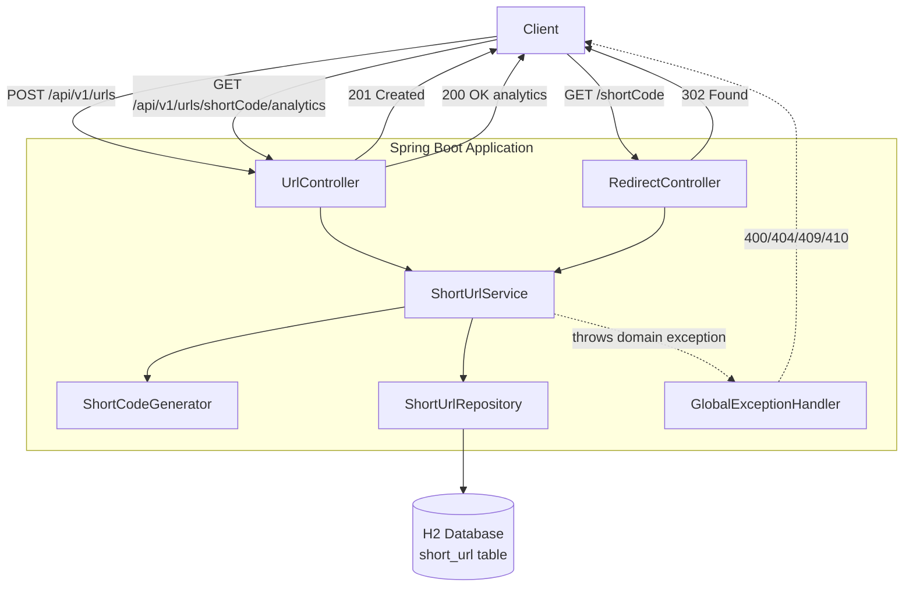

# Architecture — URL Shortener

## 1. Prototype Architecture Overview

The prototype is a single-instance Spring Boot application exposing a
REST API for URL shortening, redirection, and basic analytics. It
follows a conventional layered architecture (controller → service →
repository → database) with DTOs at the API boundary so JPA entities
are never exposed directly to clients. Requests are handled
synchronously against an embedded H2 database; there is no caching
layer, no authentication, and no horizontal scaling in this phase.

This design intentionally favors correctness and clarity over scale.
Every production concern deferred here (caching, async analytics,
distributed code generation) is documented in Section 12 rather than
built prematurely, per the project's "avoid unnecessary abstractions"
rule.

## 2. Components and Responsibilities

| Component | Responsibility |
|---|---|
| `UrlController` | Handles `POST /api/v1/urls` (create) and `GET /api/v1/urls/{shortCode}/analytics`. Delegates all logic to the service layer; maps DTOs in/out. |
| `RedirectController` | Handles `GET /{shortCode}`. Resolves the code, applies expiry rules, issues the `302` redirect. |
| `ShortUrlService` | Core business logic: input validation orchestration, alias vs. generated-code decision, collision-retry loop, atomic click-count update, expiry check. |
| `ShortUrlRepository` | Spring Data JPA repository over `ShortUrl`. Includes a `@Modifying` atomic increment query for click counting. |
| `ShortUrl` (entity) | JPA entity mapping to the single database table. Never returned from a controller. |
| Request/Response DTOs | `CreateUrlRequest`, `CreateUrlResponse`, `AnalyticsResponse`. The only shapes the API contract exposes. |
| `ShortCodeGenerator` (util) | Generates 7-character Base62 codes; stateless, no persistence knowledge. |
| `GlobalExceptionHandler` | `@RestControllerAdvice` translating domain exceptions (not-found, expired, alias-conflict, validation) into the correct HTTP status codes and a consistent error body. |
| Custom exceptions | `ShortUrlNotFoundException`, `ShortUrlExpiredException`, `AliasAlreadyExistsException`, `InvalidUrlException` — carry intent from service to handler without leaking persistence details. |

## 3. Tools and Technology Choices

| Choice | Reason |
|---|---|
| Java 17 / Spring Boot | Mandated by project instructions; mature ecosystem for layered REST services. |
| Spring Web | REST controllers and MVC dispatch. |
| Spring Data JPA | Repository abstraction; supports the atomic `@Modifying` update needed for safe click counting without hand-written JDBC. |
| Jakarta Validation | Declarative request validation (`@NotBlank`, `@Pattern`, `@Valid`) at the DTO boundary — keeps validation out of controllers/services. |
| H2 (embedded) | Zero-setup runnable prototype; schema kept portable so a move to PostgreSQL requires no structural rework (see Section 12). |
| Spring Boot Actuator | Health and metrics endpoints for observability, as required by the non-functional requirements. |
| Lombok | Reduces entity/DTO boilerplate (getters/setters/constructors); already present in `pom.xml`, no new dependency introduced. |
| JUnit 5 / Mockito / MockMvc | Unit tests for service logic (Mockito) and slice tests for controllers (MockMvc), per the required test coverage. |

No dependency beyond what `pom.xml` already declares is required for this architecture.

## 4. URL Creation Control Flow

1. Client sends `POST /api/v1/urls` with `originalUrl` and optional `customAlias` / `expiresAt`.
2. `UrlController` validates the request shape via `@Valid` (Jakarta Validation) and delegates to `ShortUrlService`.
3. `ShortUrlService` validates `originalUrl` is a syntactically well-formed HTTP/HTTPS URI.
4. If `customAlias` is present: check uniqueness via the repository; if taken, throw `AliasAlreadyExistsException` → `409`.
5. If no alias: generate a Base62 code via `ShortCodeGenerator`; attempt to persist; on a unique-constraint violation, retry generation up to a bounded attempt limit.
6. Persist the `ShortUrl` entity (`createdAt` set server-side, `clickCount = 0`).
7. Map to `CreateUrlResponse`, building the returned short URL from the configurable `app.base-url` property (not the request `Host` header).
8. Return `201 Created`.

## 5. Redirect and Analytics Control Flow

**Redirect (`GET /{shortCode}`):**
1. `RedirectController` calls `ShortUrlService.resolve(shortCode)`.
2. Service looks up the entity; if absent, throw `ShortUrlNotFoundException` → `404`.
3. If `expiresAt` is set and in the past, throw `ShortUrlExpiredException` → `410`.
4. On success, issue an atomic DB-level increment of `clickCount` and update `lastAccessedAt` (single `UPDATE ... SET click_count = click_count + 1, last_accessed_at = ?` statement — no read-modify-write in application code).
5. Controller returns `302 Found` with `Location: originalUrl`.

**Analytics (`GET /api/v1/urls/{shortCode}/analytics`):**
1. Service looks up the entity; `404` if absent.
2. Maps `clickCount` and `lastAccessedAt` to `AnalyticsResponse`.
3. Returns `200 OK`. (Analytics lookups do not themselves count as clicks.)

## 6. Database Model

Single table, matching `requirements-analysis.md` §3:

| Column | Type | Constraints |
|---|---|---|
| `id` | BIGINT | PK, generated |
| `short_code` | VARCHAR | UNIQUE, NOT NULL |
| `original_url` | VARCHAR | NOT NULL |
| `created_at` | TIMESTAMP (UTC) | NOT NULL |
| `expires_at` | TIMESTAMP (UTC) | nullable |
| `click_count` | BIGINT | NOT NULL, default 0 |
| `last_accessed_at` | TIMESTAMP (UTC) | nullable |

No separate click-event table in the prototype — analytics remain aggregate fields, per the documented scope decision. The unique index on `short_code` is the sole enforcement mechanism for collision/alias-conflict detection at the database level.

## 7. API Summary

| Method | Path | Success | Failure |
|---|---|---|---|
| `POST` | `/api/v1/urls` | `201 Created` | `400` invalid URL, `409` alias taken |
| `GET` | `/{shortCode}` | `302 Found` | `404` unknown, `410` expired |
| `GET` | `/api/v1/urls/{shortCode}/analytics` | `200 OK` | `404` unknown |

## 8. Short-Code Generation and Collision Handling

- Generated codes are 7-character Base62 (`[A-Za-z0-9]`), giving a search space large enough that collisions are rare at prototype scale but not impossible.
- Custom aliases follow a separate, stricter format (alphanumeric plus `-`/`_`, 3–20 characters) and are validated independently of generated codes.
- On insert, a collision (generated code) is detected via the database unique constraint, not a pre-check-then-insert pattern — this avoids a TOCTOU race between two concurrent creations.
- The service retries generation up to a bounded attempt count on collision; exhaustion surfaces as `500`, which is expected to be effectively unreachable at prototype data volumes.
- Custom-alias conflicts are a distinct code path (`409`, no retry — the client owns the alias choice).

## 9. Atomic Analytics-Update Approach

Click counting is the primary concurrency risk in this system: many redirects can hit the same `shortCode` simultaneously. The prototype avoids application-level read-modify-write (`read count → increment in Java → write count`), which loses updates under concurrent access, in favor of a single atomic SQL statement issued through a `@Modifying` repository method:

```sql
UPDATE short_url
SET click_count = click_count + 1, last_accessed_at = :now
WHERE short_code = :shortCode
```

This pushes the increment into the database's own atomic write path, so correctness does not depend on application-level locking, and no lost updates occur regardless of concurrent redirect volume.

## 10. Validation and Exception Handling

- **Input validation**: Jakarta Validation annotations on DTOs (`@NotBlank`, `@Pattern` for alias format, `@URL`-equivalent check for `originalUrl`) enforced via `@Valid` at the controller boundary. Validation failures are handled by the global handler and return `400` with field-level detail.
- **Domain exceptions**: `ShortUrlNotFoundException` (404), `ShortUrlExpiredException` (410), `AliasAlreadyExistsException` (409), `InvalidUrlException` (400) — thrown from the service layer, never constructed in controllers.
- **Global handler**: a single `@RestControllerAdvice` maps each domain exception and `MethodArgumentNotValidException` to its HTTP status and a consistent JSON error body (`{"status", "message", "timestamp"}`), keeping controllers free of try/catch blocks.
- **Security note**: the redirect target is always the value stored at creation time — the service never redirects to a URL derived from request parameters other than the resolved `shortCode` lookup, limiting the API's open-redirect surface to its intended function.

## 11. Key Architecture Decisions with Rationale

| Decision | Rationale |
|---|---|
| Aggregate analytics fields on `ShortUrl`, no click-event table | Matches "basic analytics" scope; avoids an unnecessary table/write-amplification for a prototype. |
| Atomic `UPDATE` for click counting instead of `@Version`/optimistic locking | A single-statement increment has no retry/conflict-exception path for the caller to handle, unlike optimistic locking, and matches the "no lost updates" requirement directly. |
| Base URL from `app.base-url` config, not the `Host` header | Prevents Host-header injection into returned short URLs; gives deployment-time control. |
| Unique DB constraint as the collision source of truth (not a pre-check) | Pre-check-then-insert is race-prone under concurrent creation; the constraint plus bounded retry is race-safe by construction. |
| DTOs at every API boundary, entity never serialized | Required by project architecture rules; also decouples the wire contract from persistence schema evolution. |
| Synchronous, single-instance, no cache | Correct match for prototype scope; premature caching/async would add complexity the requirements don't yet justify. |

## 12. Prototype Architecture vs. Production-Scale Architecture

| Concern | Prototype | Production |
|---|---|---|
| Database | Embedded H2 | PostgreSQL — durable storage, proven concurrent-write correctness |
| Read path | Direct DB read per redirect | Redis read-through cache in front of the redirect path to reduce DB load |
| AuthN/AuthZ | None (documented limitation) | API keys or OAuth2 for creation and analytics access |
| Abuse protection | None | Rate limiting / quotas (per-IP or per-key) |
| Click tracking | Synchronous atomic `UPDATE` per redirect | Async/event pipeline (queue + batch writer) if per-click history or high-volume analytics are needed |
| Code generation at scale | Single-instance bounded retry | Distributed unique-code strategy (pre-allocated ranges or coordination service) to avoid collision-retry contention across instances |
| Deployment | Single instance | Load-balanced multi-instance behind a reverse proxy/load balancer |
| Observability | Actuator health/metrics, logs | Actuator + centralized metrics (e.g., Micrometer → Prometheus/Grafana), structured logging, tracing |

## 13. Component and Flow Diagram


