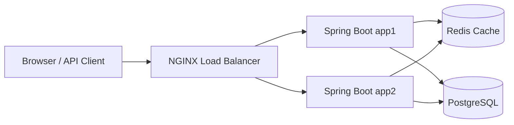

# Final Engineering Summary — URL Shortener

## Requirement interpretation

## Implementation plan

## Architecture decisions

## Greenfield execution

## Brownfield execution

## Ambiguous-requirement execution

## AI-generated outputs

## Engineer modifications and rejections

## Validation results

## Risks and trade-offs

## Assumptions

## Limitations

## Production evolution
