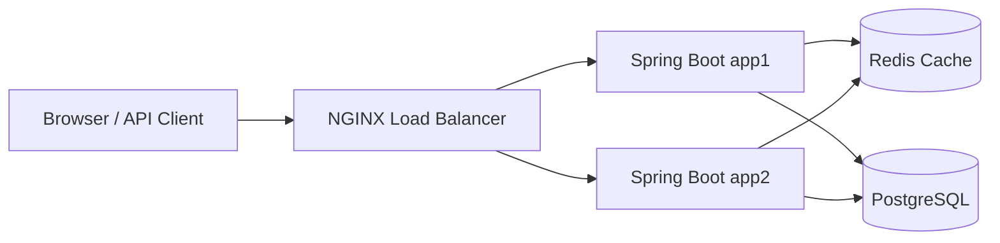

# Final Engineering Summary — URL Shortener

## Requirement interpretation

The project required a production-oriented URL shortener prototype
(creation, redirect, basic analytics, optional expiration, optional
custom aliases) and a documented evolution to a horizontally scaled
deployment (PostgreSQL, Redis, NGINX, multiple instances) without
changing the API contract. See `docs/scenarios.md` for the four worked
scenarios: greenfield core system, brownfield expiration, ambiguous
custom-alias requirement, and brownfield scalable deployment.

## Implementation plan

A layered architecture (controller → service → repository → database),
built incrementally: core creation/redirect/analytics first (Scenario
1), then expiration (Scenario 2), then custom aliases (Scenario 3), then
the `scalable` deployment profile (Scenario 4). Each step followed the
project's inspect → plan → get engineer approval → implement → test →
explain workflow.

## Architecture decisions

Documented in `docs/architecture.md` §11 and §14: aggregate (not
per-click) analytics fields; an atomic SQL `UPDATE` for click counting
instead of optimistic locking; the returned base URL is built from
config, not the request `Host` header; a database unique constraint —
not a pre-check — is the collision source of truth; DTOs are used at
every API boundary. For the `scalable` profile: a Redis cache-aside
layer in front of the redirect path only, PostgreSQL as the sole source
of truth, NGINX `least_conn` load balancing, and stateless, shared-state
application instances.

## Greenfield execution

Scenario 1 built URL creation, redirect, and basic analytics from
scratch: entity/schema, DTOs, short-code generator, repository,
exceptions, service, controllers, exception handler, and tests.

## Brownfield execution

Two brownfield changes to the running system: Scenario 2 added optional
URL expiration (`410` on redirect, additive only); Scenario 4 added the
`scalable` deployment profile (PostgreSQL, Redis, NGINX, two instances)
without changing the existing API contract or the default profile's
behavior.

## Ambiguous-requirement execution

Scenario 3 interpreted "users should be able to create memorable URLs"
as an optional custom alias supplied at creation time — the narrowest
reading consistent with the existing API design. The interpretation was
flagged for engineer confirmation before implementation, rather than
silently adopted.

## AI-generated outputs

AI (Claude Code) proposed the entity/DTO/service/controller/exception
code and tests for the core prototype, the cache-aside abstraction and
NGINX/Docker Compose configuration for the scalable deployment, and this
documentation set. See `docs/ai-usage-log.md` for the per-scenario
breakdown of AI contribution, engineer decisions, and engineer
oversight.

## Engineer modifications and rejections

Per `docs/ai-usage-log.md`: the engineer approved file changes
individually, prevented broad or unrelated repository changes, rejected
unrelated formatting changes, corrected outdated Spring Boot test
imports, and required explicit confirmation of the "memorable URL"
interpretation before any code was written.

## Validation results

- Automated: unit tests (`ShortUrlService` via Mockito), controller
  slice tests (MockMvc), and integration tests against H2 — see
  `docs/testing-strategy.md`. The full suite is re-run after each
  brownfield/ambiguous change to confirm no regression.
- Manual, against the `scalable` Docker Compose deployment: URL
  creation through NGINX (`POST http://localhost:8080/api/v1/urls`)
  returned `HTTP 201`, served by `app1`; redirect through NGINX
  (`GET http://localhost:8080/{shortCode}`) returned `HTTP 302`, served
  by `app2` — confirming NGINX load balancing and shared PostgreSQL
  persistence between instances via the `X-App-Instance` header.
- No load, performance, or availability (failover) testing has been
  performed; the results above are functional/correctness checks only.

## Risks and trade-offs

See `docs/risks-and-tradeoffs.md` for the full list. In summary:
random-code collisions and concurrent-insert races are mitigated by a
database unique constraint plus bounded retry in both profiles;
synchronous click-count updates add write latency to every redirect in
both profiles; the default profile's H2 database and single-instance
deployment are mitigated in the `scalable` profile (PostgreSQL, NGINX +
two instances); authentication, rate limiting, malicious-URL detection,
and asynchronous analytics remain unaddressed in either profile.

## Assumptions

Collected from `docs/scenarios.md`: no default expiration unless
explicitly supplied; `expiresAt` must be strictly in the future at
creation; custom aliases are case-sensitive, alphanumeric plus `-`/`_`,
3–20 characters, and set once; short codes and aliases are never
recycled; in the `scalable` profile, Redis is optional infrastructure
and PostgreSQL is the sole source of truth; `app1` and `app2` are
stateless and interchangeable.

## Limitations

No authentication or authorization, no rate limiting or abuse
protection, no malicious-URL detection, no asynchronous analytics
pipeline, and no distributed/coordinated code-generation strategy across
instances (`app1` and `app2` each use the same in-process bounded-retry
generator against a shared database constraint). No load, performance,
or availability testing has been performed on the `scalable` deployment.

## Production evolution

Documented in `docs/architecture.md` §12: rate limiting, OAuth2/API-key
authentication, asynchronous click-event processing (e.g., Kafka),
centralized metrics/tracing, and a distributed/coordinated short-code
allocation strategy remain future work. PostgreSQL, Redis caching, and
multi-instance load balancing — previously listed as production
evolution — are implemented via the `scalable` Docker Compose profile
(`docs/architecture.md` §14).
