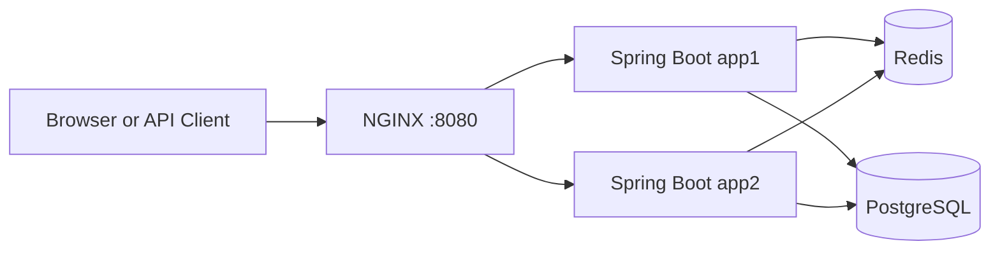
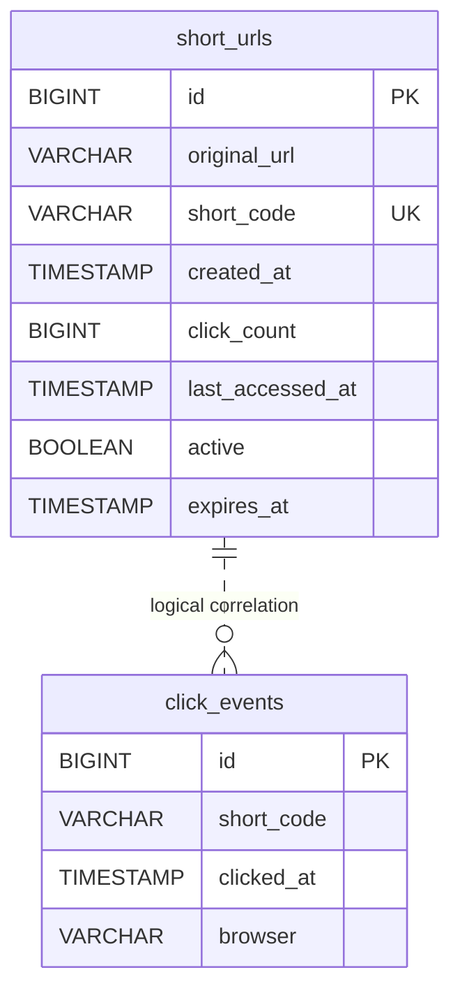

# Architecture and Design

Reformatted and tightened from `docs/01-engineering-design-and-architecture.md`.
This file covers components, control flow, and design mechanisms only — for
risks, trade-offs, and limitations, see `documents/05-final-summary.md`.

## 1. Overview

A Java 17, Spring Boot URL shortener that evolved from a single-instance
greenfield service into a Docker-based system with shared persistence,
Redis caching, two application instances, NGINX routing, analytics, and
automated testing.

## 2. Scope

### Implemented
- Valid HTTP/HTTPS URL creation
- Seven-character Base62 short codes
- Optional custom aliases
- Optional expiration
- `302 Found` redirects
- Aggregate click analytics
- Detailed click-event capture
- Browser detection from `User-Agent`
- Consistent API error responses
- Static browser UI
- H2 for local development
- PostgreSQL for shared persistence
- Optional Redis cache-aside behavior
- Two Spring Boot instances behind NGINX
- Docker Compose startup
- Unit, controller, integration, security, and k6 test assets

### Out of scope
- Authentication and authorization
- User ownership
- Multi-region deployment
- Production secret management
- Durable message-queue delivery

## 3. Architecture



The application instances are stateless and share PostgreSQL and Redis.
NGINX provides one public endpoint and distributes requests between them.
The default local profile uses H2.

### Main components

| Component | Responsibility |
|---|---|
| `UrlController` | URL creation and analytics APIs |
| `RedirectController` | Short-code resolution and redirects |
| `UrlShortenerService` | Creation, aliases, expiration, caching, resolution, analytics |
| `ShortUrlRepository` | Persistence and atomic click updates |
| `ShortCodeGenerator` | Seven-character Base62 generation |
| `RedisRedirectCache` | Redis cache-aside implementation |
| `ClickEventRecorder` | Asynchronous event persistence |
| `BrowserDetector` | Browser-family detection |
| `GlobalExceptionHandler` | Consistent sanitized errors |
| `InstanceHeaderFilter` | Adds `X-App-Instance` |

### Runtime profiles

| Profile | Database | Redis | Purpose |
|---|---|---|---|
| Default | H2 | Disabled (`app.cache.enabled=false`) | Local development |
| Scalable | PostgreSQL | Enabled (`app.cache.enabled=true`, cache-aside) | Shared multi-instance deployment |

## 4. Data Model

### `ShortUrl`

| Field | Purpose |
|---|---|
| `id` | Internal relational primary key |
| `originalUrl` | Destination URL |
| `shortCode` | Generated code or custom alias |
| `createdAt` | Creation time |
| `clickCount` | Successful redirect count |
| `lastAccessedAt` | Latest access time |
| `active` | Logical active state |
| `expiresAt` | Optional expiration |

`shortCode` has a unique database constraint for uniqueness and fast lookup.

### `ClickEvent`

| Field | Purpose |
|---|---|
| `id` | Internal relational primary key |
| `shortCode` | Successfully resolved code |
| `clickedAt` | Redirect time |
| `browser` | Browser derived from `User-Agent` |

The current implementation does not store country information.
`ClickEvent.shortCode` is a logical reference; no database foreign key is used.



The unique index on `short_code` supports redirects, analytics lookup,
collision checks, and custom-alias checks.

## 5. API Design

### Create
```http
POST /api/v1/urls
Content-Type: application/json
```

```json
{
  "originalUrl": "https://example.com/articles/system-design",
  "expiresAt": "2026-08-10T18:00:00Z",
  "customAlias": "system-design"
}
```

Success: `201 Created`.

### Redirect
```http
GET /{shortCode}
```

```http
HTTP/1.1 302 Found
Location: https://example.com/articles/system-design
X-App-Instance: app1
```

The route accepts letters, digits, hyphens, and underscores so static
resources are not interpreted as short codes.

### Analytics
```http
GET /api/v1/urls/{shortCode}/analytics
```

The response includes original URL, click count, creation time, last
access, active state, and expiration.

### Errors

| Situation | Status |
|---|---|
| Invalid request | `400 Bad Request` |
| Unknown or inactive code | `404 Not Found` |
| Duplicate or reserved alias | `409 Conflict` |
| Expired code | `410 Gone` |
| Code generation exhausted | `503 Service Unavailable` |
| Unexpected error | `500 Internal Server Error` |

Unexpected errors are logged internally while clients receive sanitized
responses without stack traces or database details.

## 6. Core Design Mechanisms

### Base62 short codes
Alphabet:
```text
0123456789abcdefghijklmnopqrstuvwxyzABCDEFGHIJKLMNOPQRSTUVWXYZ
```

Each generated code has seven characters:
```text
62^7 = 3,521,614,606,208 possible values
```

The generator uses `SecureRandom`, up to five attempts, application-level
collision checks, and a database unique constraint. The database `Long id`
remains the internal primary key.

### Expiration
- `expiresAt` is optional; existing clients can omit it.
- `Instant` provides UTC-safe handling.
- Past values are rejected.
- Expired links return `410 Gone` and do not increment analytics.
- Expired codes are not reused.
- Redis TTL does not exceed the remaining link lifetime.

### Custom aliases
Rules:
- Lowercase normalization.
- Length from 4 to 30 characters.
- Letters, digits, hyphens, and underscores only.
- Duplicate aliases return `409 Conflict`.
- Reserved routes return `409 Conflict`.
- Expired or inactive aliases are not reused.

Reserved examples:
```text
api, actuator, health, admin, login, logout, docs, swagger
```

### Atomic aggregate analytics
A read-modify-save sequence could lose updates under concurrency. The
repository therefore performs one conditional update:

```text
clickCount = clickCount + 1
lastAccessedAt = accessedAt
```

The update applies only when the mapping is active and not expired.

### Asynchronous detailed events
`ClickEventRecorder` uses `@Async` in a separate Spring bean.

The controller passes:
- `shortCode`
- Current timestamp
- `User-Agent`

`HttpServletRequest` is not passed to the background thread. Event-save
failures are caught and logged without failing the redirect.

### Redis cache-aside
Redis stores mappings under:
```text
redirect:{shortCode}
```

Behavior:
- Cache hit: use Redis.
- Cache miss: load from PostgreSQL and populate Redis.
- Redis failure: continue through PostgreSQL.
- PostgreSQL remains the source of truth.
- Cache TTL respects expiration.

### Horizontal execution
The scalable profile uses PostgreSQL and Redis so app1 and app2 share
state. `X-App-Instance` identifies the serving application instance.

## 7. Main Request Flow

### URL creation
1. Validate the request.
2. Normalize an optional custom alias.
3. Generate a Base62 code when no alias is supplied.
4. Check for collisions.
5. Persist `ShortUrl`.
6. Return `201 Created`.

### Redirect
1. Receive the short code.
2. Check Redis when enabled.
3. On a miss, load from PostgreSQL.
4. Validate active and expiration state.
5. Atomically update aggregate analytics.
6. Trigger detailed event persistence asynchronously.
7. Return `302 Found`.

Aggregate analytics are immediately consistent. Detailed event persistence
is eventually consistent.

## 8. Architecture Evolution

| Stage | Decision |
|---|---|
| Greenfield core | Spring Boot, JPA, H2 |
| Uniqueness | Base62, retries, unique constraint |
| Analytics | Atomic repository update |
| Expiration | Optional `Instant expiresAt` |
| Custom aliases | Validation and reservation rules |
| Browser UI | Static HTML, CSS, JavaScript |
| Shared persistence | PostgreSQL |
| Redirect caching | Redis cache-aside |
| Horizontal execution | app1 and app2 |
| Single entry point | NGINX |
| Reproducibility | Docker Compose |
| Detailed analytics | Asynchronous `ClickEvent` persistence |
